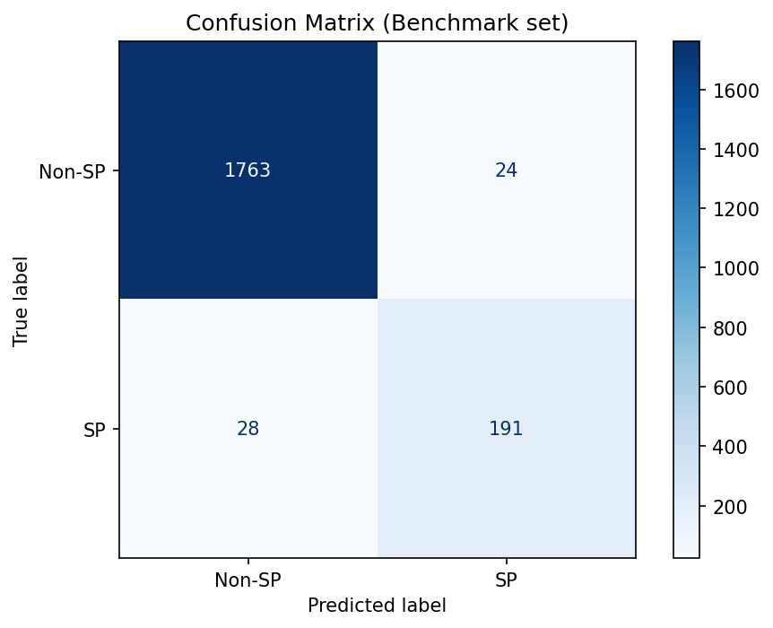
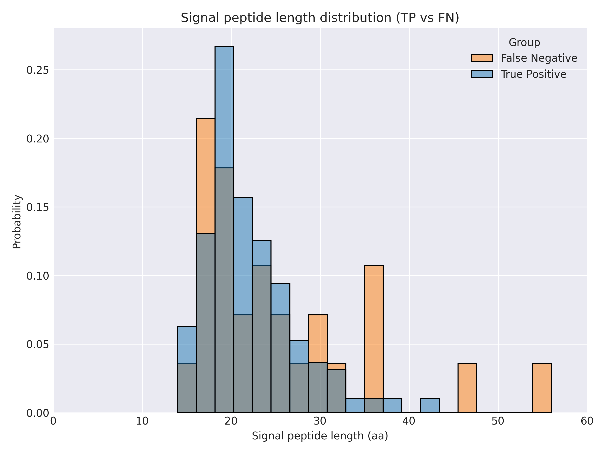
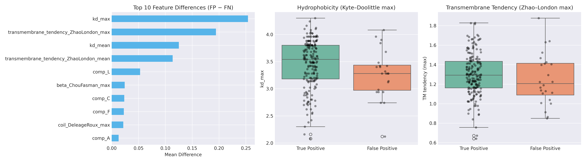

# Feature Extraction, Selection and SVM

## Feature Extraction
Protein sequences were numerically encoded based on physicochemical properties obtained from the [ProtScale (ExPASy) database](https://web.expasy.org/protscale/).

For each amino acid, the following features were extracted:

- **Kyte–Doolittle Hydrophobicity**  
  Reflects the hydrophobic or hydrophilic nature of amino acids.

- **Polarity (Zimmerman scale)**  
  Measures polarity, contributing to solubility and hydrogen bonding.

- **Transmembrane Tendency (Zhao & London)**  
  Estimates the likelihood of residues being part of transmembrane segments.

- **Flexibility (Bhaskaran & Ponnuswamy)**  
  Represents local conformational flexibility of amino acid residues.

- **Secondary Structure Propensities:**  
  - **Alpha-helix (Chou & Fasman)**  
  - **Coil (Deleage & Roux)**
  - **Beta-sheet (Chou & Fasman)** 

Each protein sequence was converted into a **feature dataframe**, and sliding windows 5 and 9 were applied to capture **local context** across residues.

| Category | Feature Names |
|-----------|----------------|
| **Amino Acid Composition (20)** | `comp_A`, `comp_C`, `comp_D`, `comp_E`, `comp_F`, `comp_G`, `comp_H`, `comp_I`, `comp_K`, `comp_L`, `comp_M`, `comp_N`, `comp_P`, `comp_Q`, `comp_R`, `comp_S`, `comp_T`, `comp_V`, `comp_W`, `comp_Y` |
| **Hydrophobicity (Kyte–Doolittle)** | `kd_mean`, `kd_max` |
| **Polarity (Zimmerman)** | `polarity_Zimmerman_mean`, `polarity_Zimmerman_max` |
| **Transmembrane Tendency (Zhao & London)** | `transmembrane_tendency_ZhaoLondon_mean`, `transmembrane_tendency_ZhaoLondon_max` |
| **Flexibility (Bhaskaran & Ponnuswamy)** | `flexibility_BhaskaranPonnuswamy_mean`, `flexibility_BhaskaranPonnuswamy_max` |
| **Secondary Structure Propensity** | `helix_ChouFasman_mean`, `helix_ChouFasman_max`, `coil_DeleageRoux_mean`, `coil_DeleageRoux_max`, `beta_ChouFasman_mean`, `beta_ChouFasman_max` |

## Feature Selection & SVM

### Overview
This project implements a **nested 5-fold cross-validation** pipeline combining **Random Forest (RF)** feature ranking and **SVM** classification.  
RF provides **Gini-based feature importances**, and SVM hyperparameters (C, γ) are optimized through a focused grid search.

### Fold-wise Performance Metrics
| Outer Fold | Accuracy | MCC | Precision | Recall | F1 |
|:-----------:|:---------:|:----:|:----------:|:--------:|:--------:|
| 0 | 0.964 | 0.813 | 0.841 | 0.826 | 0.833 |
| 1 | 0.978 | 0.887 | 0.915 | 0.884 | 0.899 |
| 2 | 0.975 | 0.870 | 0.905 | 0.864 | 0.884 |
| 3 | 0.977 | 0.883 | 0.887 | 0.904 | 0.895 |
| 4 | 0.971 | 0.852 | 0.866 | 0.871 | 0.868 |

### Cross-Validation Overall Average Performance Metrics (Mean ± SE)

| Metric     | Mean  | ± SE  |
|-------------|-------|-------|
| Accuracy    | 0.973 | 0.003 |
| MCC         | 0.861 | 0.013 |
| Precision   | 0.883 | 0.013 |
| Recall      | 0.870 | 0.013 |
| F1          | 0.876 | 0.012 |

## Final Model Summary

### Model Description
The **final SVM model (`final_svm_model.pkl`)** was generated using the best hyperparameters obtained from the **Random Forest (RF) + Support Vector Machine (SVM)** nested cross-validation pipeline.  
This workflow integrated **RF-based feature ranking** with **SVM (RBF kernel)** optimization to identify the most robust parameter configuration.

### Training Details
- **Training data:** `np_all_features.npz`
- **Feature count:** 34
- **Selected parameters:** `C = 10.0`, `gamma = 0.01`
- **Model type:** `SVM (RBF kernel)`
- **Output file:** `final_svm_model.pkl`

### Benchmark Evaluation
After training on the full dataset, the model was evaluated on the independent benchmark dataset (`np_benchmark_features.npz`).  
The obtained performance metrics are summarized below:

| **Metric**   | **Score** |
|---------------|-----------|
| Accuracy      | 0.9741 |
| MCC           | 0.8657 |
| Precision     | 0.8884 |
| Recall        | 0.8721 |
| F1-score      | 0.8802 |

**Confusion Matrix**

**FP count:** 24  **FN count:** 28  **TP count:** 191 

**FPR (For Transmembrane Features):** 12.61%

### Signal Peptide Length Distribution
Average signal peptide (cleavage site) lengths:

| Group | Mean length (aa) |
|:------|-----------------:|
| True Positives | **22.33** |
| False Negatives | **25.11** |

*Figure 1.* Comparison of signal peptide lengths for **True Positives (TP)** and **False Negatives (FN)**.

### Feature-Level Analysis
**Top 10 Feature Differences (FP − FN):**
FP sequences show elevated hydrophobicity (Kyte–Doolittle) and higher transmembrane tendency.
This aligns with the hypothesis that **hydrophobic N-terminal transmembrane helices** often lead to FP predictions.

*Figure 2.* The figure shows the top 10 features that causes FP and box plot (TP & FP) for `kd_max` & `Zhao_London_max`. 

### Taxonomic Distribution of Errors

| Kingdom | FPR (%) | FNR (%) |
|:---------|---------:|--------:|
| Metazoa | 2.03 | 11.83 |
| Plants | 0.95 | 8.33 |
| Fungi | 0.39 | 22.73 |
| Other | 0.00 | 25.00 |

**False Positive (FP) Distribution**

| Kingdom | Percentage (%) |
|:---------|---------------:|
| Metazoa | 79.2 |
| Plants | 12.5 |
| Fungi | 8.3 |

**False Negative (FN) Distribution**

| Kingdom | Percentage (%) |
|:---------|---------------:|
| Metazoa | 71.4 |
| Fungi | 17.9 |
| Plants | 7.1 |
| Other | 3.6 |

#### Overall
- **False Positives** mainly occur in sequences with high transmembrane hydrophobicity.
- **False Negatives** tend to have slightly **longer cleavage regions** than expected.
