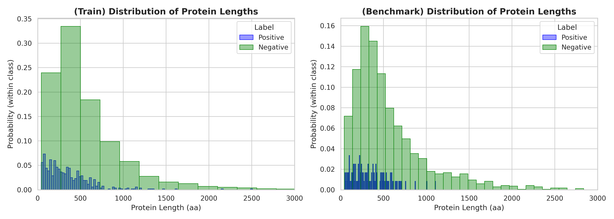
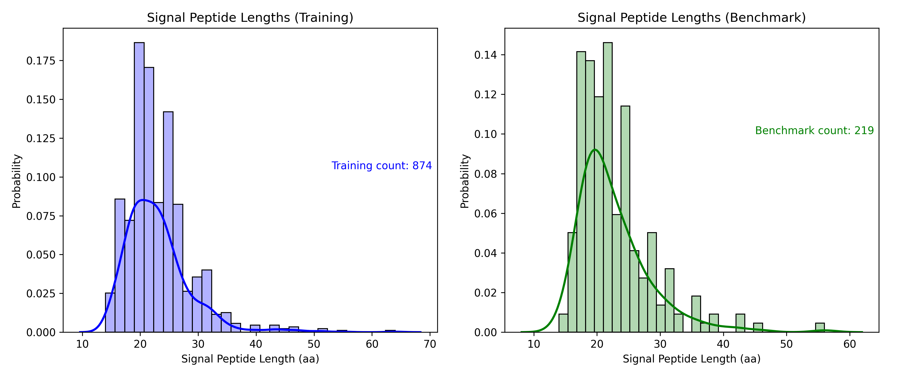
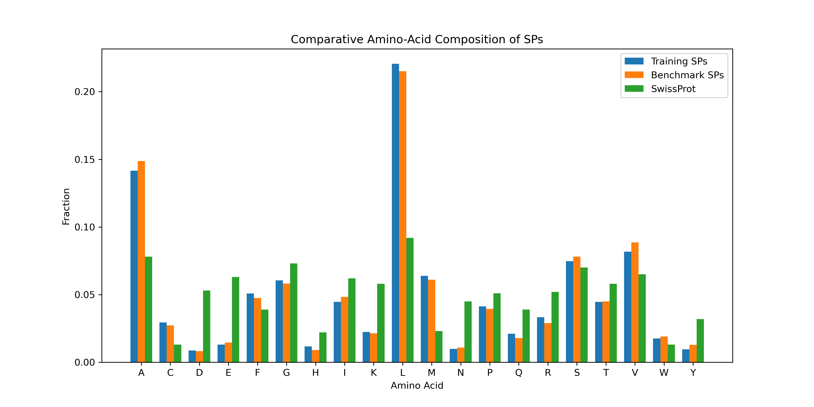
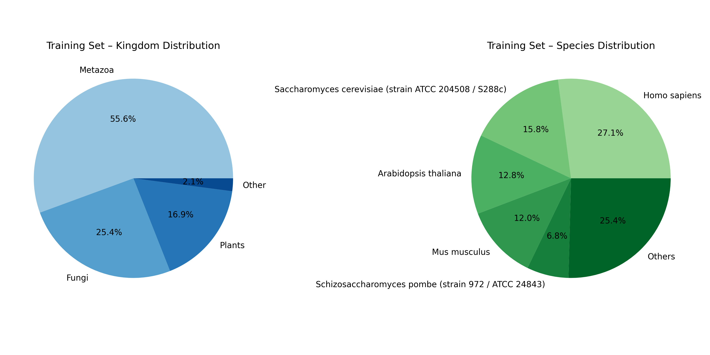
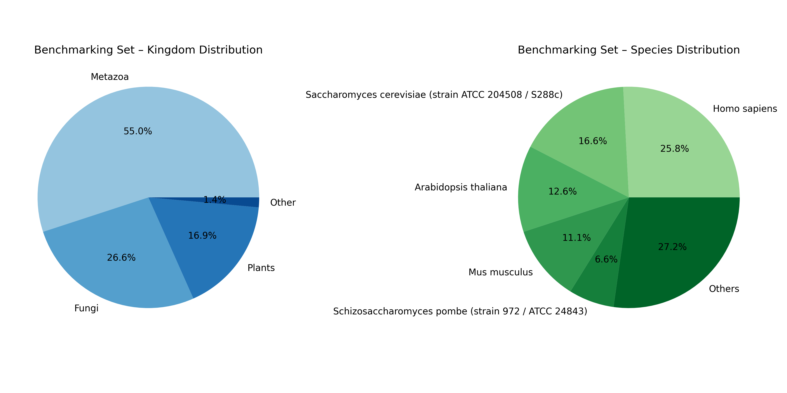
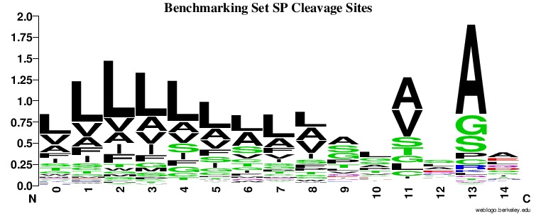

# Data Analysis and Visualization Part

In this subfolder we analyzes and visualizes the properties of the training and benchmarking datasets used for signal peptide (SP) prediction.
Each section describes the analysis and includes the corresponding plots.

---

## 1. Distribution of Protein Lengths

We compare the length distributions of **positive** (signal peptide-containing) and **negative** (non-signal peptide) protein sequences.
This helps to identify potential biases in protein length between the two groups.

---

## 2. Distribution of Signal Peptide (SP) Lengths

We analyze the length distribution of signal peptides across the dataset.
This provides insights into the typical size range of signal peptides.

---

## 3. Comparative Amino Acid Composition

We compare the amino acid composition of signal peptides (SPs) against the **SwissProt background distribution** (see [SwissProt statistics](https://web.expasy.org/docs/relnotes/relstat.html)).
This highlights which amino acids are enriched or depleted in SPs relative to general proteins.

---

## 4. Taxonomic Classification

We investigate the taxonomic distribution of sequences in the dataset, at both the **kingdom** and **species** levels.

- **Training Dataset Graphs:**
  

- **Benchmark Dataset Graphs:**
  

---

## 5. Sequence Logos of SP Cleavage Sites

We extract motifs around the **signal peptide cleavage site** using a window of `[-13, +2]`.
Sequence logos are generated with **WebLogo**, revealing conserved sequence patterns at cleavage sites.

---
