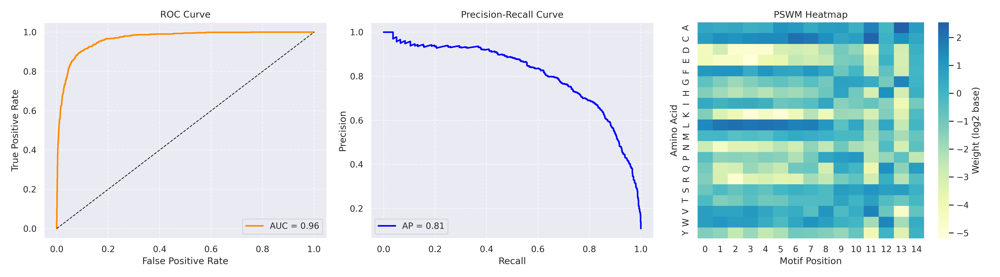

# Model Creation with Position-Specific Weight Matrix (PSWM) Based For Signal Peptide Prediction

## Workflow
1. **Motif Extraction**
   - For each training fold, motifs are extracted around known cleavage sites (`Signal_Peptide` column in the dataset).
   - These motifs are aligned and used to construct a **PSWM matrix**.

2. **PSWM Construction**
   - Frequencies of amino acids at each motif position are computed.
   - Log-odds scores are calculated against amino acid background probabilities (`np.log2`).
   - This produces a scoring matrix (**W**) used for evaluation.

3. **Scoring New Sequences**
   - Each sequence is scanned using a sliding window.
   - For each window, a score is computed based on PSWM values.
   - The best window score is taken as the sequence score.

4. **Cross-Validation**
   - The dataset is split into folds.
   - Each fold is used once for testing, once for validation, and the rest for training.
   - Performance metrics are calculated for each test fold:
     - Accuracy
     - Recall (Sensitivity)
     - Precision (PPV)
     - F1-score
     - MCC (Matthews Correlation Coefficient)
     - Optimal threshold (selected from validation fold).
   - After all runs, the **mean ± standard error (SE)** across folds is reported.

5. **Visualization**
   - Combined plots are generated:
     - **ROC Curve** (aggregated test predictions across folds).
     - **Precision-Recall Curve**.
     - **Average PSWM Heatmap** (mean weight matrix across folds, with log-odds scores annotated).
### Cross-validation Average Performance
| Metric      | Mean ± SE        |
|------------|----------------|
| Accuracy    | 0.9387 ± 0.0037 |
| Recall     | 0.7628 ± 0.0235 |
| Precision  | 0.7062 ± 0.0232 |
| MCC        | 0.6987 ± 0.0148 |
| Threshold(log2 base)  | 8.9223 ± 0.2660 |
| F1 Score   | 0.7309 ± 0.0132 |

### Combined Performance Metrics Visualization

